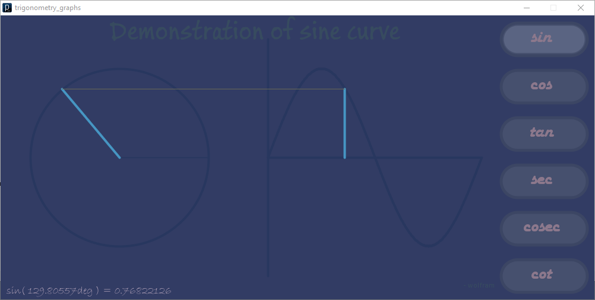
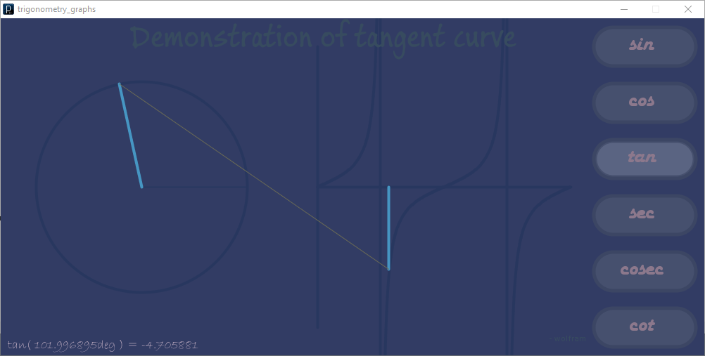

Demonstration of Trignometric functions.

 
 
 
 

### references

- [How to embed a Processing sketch onto an HTML page](https://cs.nyu.edu/~kapp/cs101/processing_on_the_web/)
- [Tutorial 13: Working with Images](http://www.peepproject.com/tutorials/tutorial/19/view)
- [Processing.js fonts not loading](https://stackoverflow.com/q/55281154/1413259)

